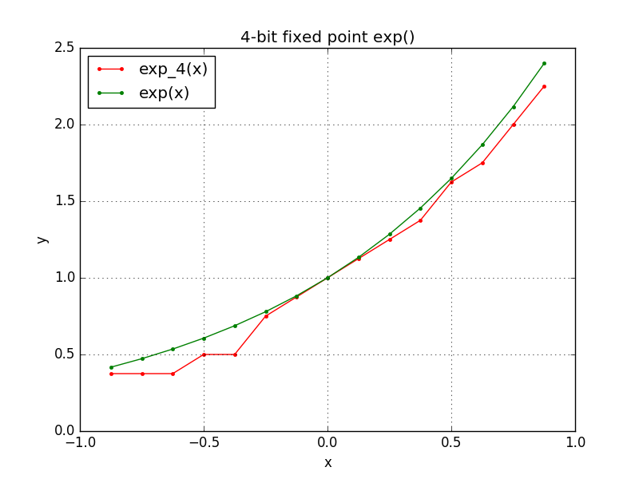
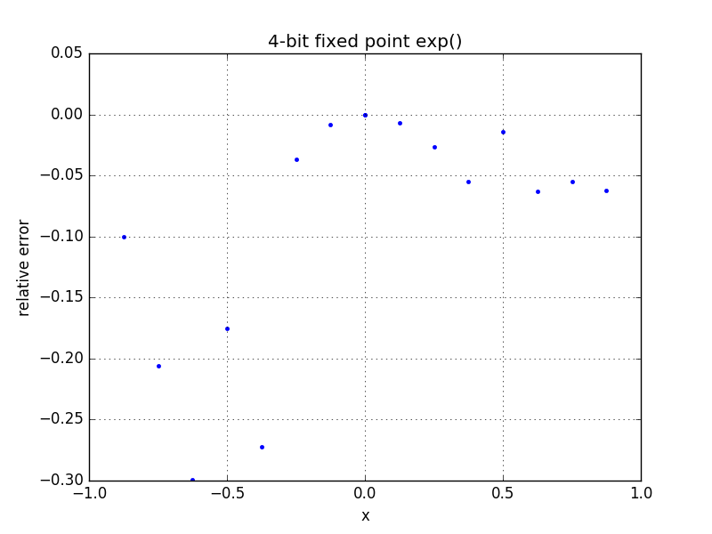
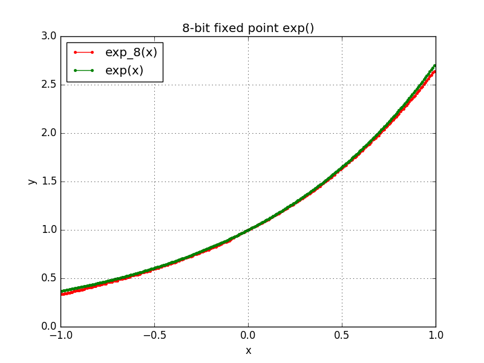
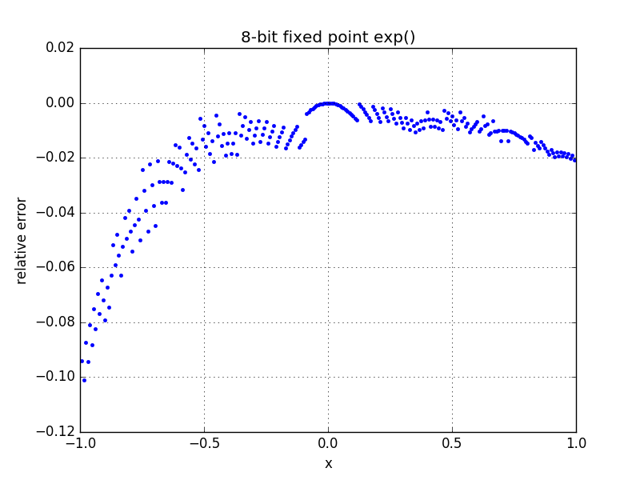

# Exponential function 

This is fixed-point implementation of exp(x).  I wrote this mainly to work past
some of my (initially horrible) misunderstandings about how to model a simple
expression evaluation in MyHDL.

The fixed-point math itself is packaged into a class, `FixedDef`.  The exponential
function is implemented with combinatorial logic in `ExpComb`, and a sequential
wrapper `ExpSeq` is implemented around that.  Separating the actual function and 
the sequential logic seems like the most reasonable approach at the moment.

The exponential is computed by a Taylor expansion around 0, truncated to the 
second-order term.  Depending on how much error you can tolerate, this may or 
may not be good enough, and right now I don't know what the tradeoff in terms
of chip area vs. accuracy would be if an alternate approximation (found with 
Remez' algorithm, etc.) was used.

When you run the `exp.py` script it will create Verilog versions of the 
combinatorial and sequential exp functions, simulate the design across
most of the range of the possible inputs, and plot the relative error versus
these inputs. (The edges of the ranges could be handled better--right now they 
give errors about being out of range for the fixed-point representation.)

When you run the `build.sh` script, it will attempt to synthesize the generated
Verilog designs for the Lattice ICEStick.

# 4-bit results

# 8-bit results

